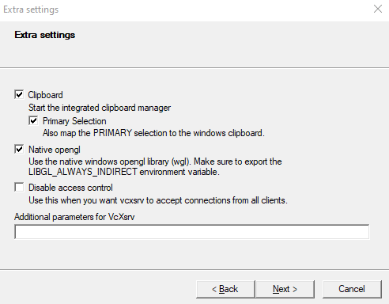

# Tutorial de Instalação do Ubuntu (dual boot, máquina virtual e WSL2)
Este é um guia básico para a intalação de uma distro de Linux junto com outro sistema operacional (dualboot), utilizando uma máquina virtual (VM) ou utilizando o Windows Subsystem for Linux (WSL2).

## Índice
1. [Introdução](#introducao)
  1. [Dualboot](#dualboot)
  2. [VM](#vm)
  3. [WSL2](#wsl2)

## Introdução 
Para começar, você vai precisar ter o [.iso](https://fileinfo.com/extension/iso "O que é uma iso?") do [Ubuntu](https://ubuntu.com/download/desktop "Site do Ubuntu para download") baixada no seu computador.

OBS: Existem diversas distros de Linux, vou comentar somente sobre Ubuntu no guia por ser uma distro mais amigável para iniciantes do Linux, e em geral dá menos dor de cabeça para ajeitar ou configurar alguma coisa.

Recomendo a versão _20.04 LTS_ (Long Term Support) em vez de outras versões, pois LTS significa que essa versão garante suporte por um período longo de tempo, ou seja, ela continuará recebendo updates e correções.
OBS2: As imagens do guia mostram a versão 18.04 LTS, porém o processo de instalação é semelhante para a versão 20.04.

No futuro, outra versão poderá ser lançada e o Ubuntu possui [um recurso](https://ubuntu.com/tutorials/tutorial-upgrading-ubuntu-desktop#1-before-you-start "Como atualizar o Ubuntu de uma versão para outra") para atualizar suas versões de maneira simples. Fica a dica para quem quiser fazer o upgrade de maneira fácil.
Tendo feito o download da iso do Ubuntu, vamos começar a instalação.

Você pode fazer a instalação tanto em uma [máquina virtual](https://github.com/LMFRomero/linuxTutorial/blob/master/README.md#m%C3%A1quina-virtual), em sua própria máquina por meio de um [dual boot](https://github.com/LMFRomero/linuxTutorial/blob/master/README.md#dual-boot) ou ainda utilizar o WSL2 caso possua um Windows 10 relativamente atualizado (versões mais antigas não possuem suporte para o WSL2).
Alguns passos no momento da instalação (como configurar horas e etc) foram omitidos por serem demasiados intuitivos.
 

### Dual boot: 
Para instalar com dual boot, você precisa ter baixado o [Rufus](https://github.com/pbatard/rufus/releases/download/v3.9/rufus-3.9.exe "Baixe o Rufus aqui") no Windows, que é um programa pra criação de pendrives bootáveis. Antes de iniciar, lembre-se: os arquivos do pendrive serão **apagados**, por isso faça backup antes de iniciar.
Agora, abra o programa pra ver a seguinte tela:

 

Para criar o pendrive bootável, escolha o pendrive onde você irá criar o instalador em *Dispositivos* procure o arquivo .iso com o botão SELECIONAR, clique em INICIAR, depois em OK, na janela que abrirá.

Antes do próximo passo, veja quanta memória o seu Windows ocupa. Você pode fazer isso vendo nas propriedades do drive (C:):

 

Agora que você tem um pendrive bootável, vamos em *Settings > Update & Security > Recovery* nas configurações do Windows, e, embaixo de *Advanced Startup*, clique em *Restart Now*.

Selecione a opção de iniciar com um dispositivo, e procure por USB HDD, ou algo próximo disso.

O GRUB será iniciado, e você escolhe a opção de instalar o Ubuntu.
 

Configure seu teclado, e avance para o próximo passo.

Também aparecerá uma tela para se conectar ao wifi.

Agora, você irá escolher como será a instalação.

 

Prossiga com a *Instalação normal* e a opção de *Baixar atualizações enquanto instala o Ubuntu*

Agora é a parte do particionamento:
 
Você irá escolher a opção "*Instalar o Ubuntu ao lado do Windows*". Com isso, abrirá uma tela onde você pode arrastar um divisor para particionar o disco. **Tome cuidado para não deixar o Windows com menos memória do que o que está sendo usado para não apagar os arquivos e/ou corromper o sistema**.

Após escolher a memória destinada aos SOs, clique em *Instalar agora* e prossiga com a instalação até o final e você terá seu Ubuntu pronto pra ser usado.
 

### Máquina virtual: 
Para instalar em uma máquina virtual, você irá precisar de um software de virtualização, como o [VirtualBox](https://download.virtualbox.org/virtualbox/6.1.4/VirtualBox-6.1.4-136177-Win.exe "Baixe o virtualbox aqui"). Instale caso você ainda não tenha.

 

Clique em **New**, para criar uma nova máquina virtual, escolha um nome e coloque as configurações abaixo e depois clique em **Next**.

 

Escolha um tamanho da memória que será alocada para a VM. Busque manter na faixa verde, pois, mesmo alocando mais RAM para a VM, o seu computador pode perder performance, fazendo a VM também perder. Pessoalmente, mantendo no limite da parte verde (~4096 MB, no meu caso), nunca deu muitos problemas.

 

Na próxima tela, você irá criar um novo disco virtual.

 

Clique em **Create** e depois em **Next** até chegar nesta imagem:

 

Dê o tamanho de memória para o HD virtual que julgar necessário (a título de comparação, se você usar bastante Linux mas não como SO principal, 30 GBs é mais que suficiente) e clique em **Create**.

Agora, clique com o botão direito na VM e vá em **Settings**.

 

Lá você irá carregar a ISO com os seguintes passos:

 

Em *4*, você procura a ISO pelos seus diretórios.

Ainda em **Settings**, vá em Display (acima de *1*), procure por Graphics Controller e troque pra VBoxVGA (iremos desfazer isso depois). Isso nos ajudará a mudar a resolução na hora da instalação, para melhor entendimento, pois o VirtualBox pode colocar uma resolução automaticamente que ficará truncando a tela.

Após isso, clique em **OK** e depois em **Start**.

Em **View**, vá em *Virtual Screen 1* e use *Resize* para trocar a resolução para uma que mais te agrade. Depois, ainda em **View**, clique em *Adjust Windows Size*.

 

Depois, clique em *Instalar Ubuntu*. 

Configure seu teclado, e avance para o próximo passo.

Agora, você irá escolher como será a instalação.

 

Prossiga com a *Instalação normal* e a opção de *Baixar atualizações enquanto instala o Ubuntu*

Agora é a parte do particionamento. Nesse caso, como estamos usando o disco virtual, então iremos usar todo o disco:

 

Clique em *Instalar agora*, e continue com a instalação até finalizar.

Quando o SO estiver inicializado, feche a máquina virtual (use a opção de "*Power off the machine*"). Clique com o botão direito na VM, vá em *Settings > Display > Graphics Controller* e selecione VMSVGA novamente. Inicie de novo a VM, vá em *Configurações > Dispositivos > Monitores* e ajuste a resolução. Após isso, seu Ubuntu estará pronto para uso. 

### WSL2  
O WSL2 permite executar um ambiente Linux dentro do Windows 10 sem precisar de uma máquina virtual.

Para a instalação recomendo seguir esse [tutorial da própria Microsoft](https://docs.microsoft.com/pt-br/windows/wsl/install-win10 "Guia da Microsoft")

#### Utilizando Interface Gráfica no WSL2
Por padrão o WSL2 fornece somente um terminal do Linux, ou seja, não é possível rodar aplicações gráficas nele. Já existem versões preview do Windows 10 que possuem nativamente esse suporte para o WSL, porém a maioria das pessoas não utilizam versões Preview do Windows, portanto ainda não tem acesso a essa funcionalidade. 

Uma maneira de contornar esse problema e conseguir executar aplicações gráficas é rodando um X11 server no Windows, exemplos são o Xming, e o X410, porém o segundo é pago, enquanto o Xming é gratuito.

Após o download e instalação do Xming, execute o XLaunch, a tela abaixo deve aparecer:

 

Selecione a opção de Multiple Windows, para que só apareça alguma janela ao executar uma aplicação gráfica pelo WSL2.
Em seguida selecione "Start no client", clique em Next, e a tela abaixo deve aparecer:

 

Seleciona a caixa "Disable acess control", para conseguir conectar a WSL2 no Xming com mais facilidade.
OBS: Desabilitar o controle de acesso pode não ser a melhor ideia em todos os casos, mas imagino que na maioria dos casos não deve haver problema.

Clique em Finish.

Agora abra o WSL2, e digite um dos comandos abaixo para obter o IP do Windows:
`cat /etc/resolv.conf` ou `ipconfig.exe`.

Em seguida digite o seguinte comando:
`export DISPLAY=IP:0`, por exemplo, se o IP é 255.255.255.255 o comando seria `export DISPLAY=255.255.255.255:0`

Nesse ponto tudo já deve estar funcionando, uma maneira fácil de testar é utilizando o `xeyes`, que pode ser instalado pelo pacote x11-apps.
Para instalar basta digitar os seguintes comandos:
`sudo apt install x11-apps`

Agora basta digitar `xeyes` e uma janela com dois olhinhos que seguem o mouse deve aparecer na tela.

OBS: O comando `export DISPLAY=IP:0` deve ser utilizado sempre que ligar a WSL2 novamente. Uma maneira de facilitar é utilizando `export DISPLAY=$(route.exe print | grep 0.0.0.0 | head -1 | awk '{print $4}'):0.0
`, pois esse comando obtém o IP automaticamente.

OBS2: Existem maneiras de garantir que o comando seja executado automaticamente ao inicializar a WSL2, mas não serão comentadas nesse guia.

OBS3: Algumas vezes, ao fechar o terminal do WSL2 a máquina pode não ser desligada (dependendo de como ela é fechada), e nesse caso ela pode ficar consumindo uma porção de RAM que pode atrapalhar o uso do Windows, nesse caso basta abrir o PowerShell e executar o comando `wsl --shutdown`, para desligar quaisquer sessões de WSL que ainda estiverem abertas.
